# WOORIDO 공통 UX 플로우 v3.0

> **Purpose:** 플랫폼 공통 사용자 여정 및 화면별 상태 정의
> **Last Updated:** 2026-01-21
> **Status:** 확장됨 (Phase별 분리)
> **관련 문서:** [P0 플로우](./UX_FLOW_P0.md) | [P1 플로우](./UX_FLOW_P1.md)

---

## 1. 핵심 사용자 여정 (User Journey)

```
┌─────────────────────────────────────────────────────────────────────┐
│                         WOORIDO 사용자 여정                          │
├─────────────────────────────────────────────────────────────────────┤
│                                                                     │
│  [발견]        [가입]        [활동]        [성장]        [완주]     │
│    │            │            │            │            │           │
│    ▼            ▼            ▼            ▼            ▼           │
│  검색/추천   회원가입      SNS 활동     정기 모임     1년 달성     │
│     │        충전         투표 참여     리더 활동     인증 마크     │
│     │        챌린지 가입   장부 확인                               │
│     │                                                              │
│     └──────────────────────────────────────────────────────────────│
│                                                                     │
└─────────────────────────────────────────────────────────────────────┘
```

---

## 2. 핵심 플로우

### 2.1 신규 가입 → 첫 챌린지 가입 (웹 진입)

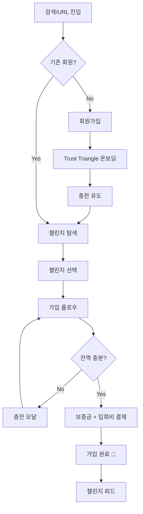

### 2.2 보증금 충당 → 권한 복구

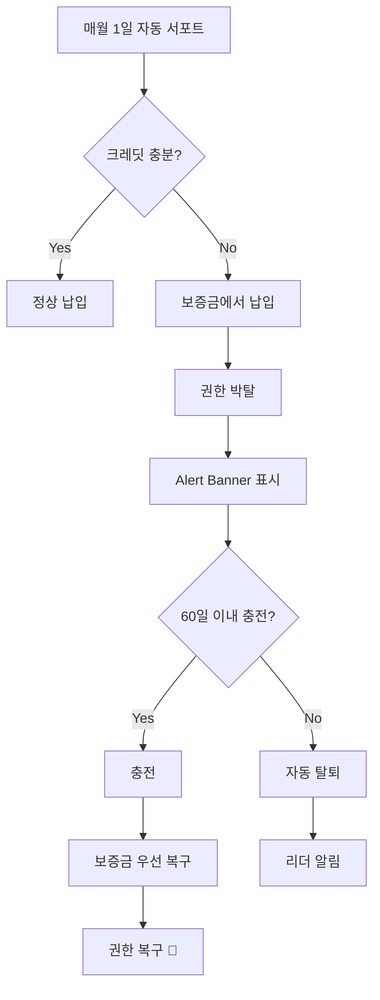

### 2.3 정기 모임 → 지출 승인

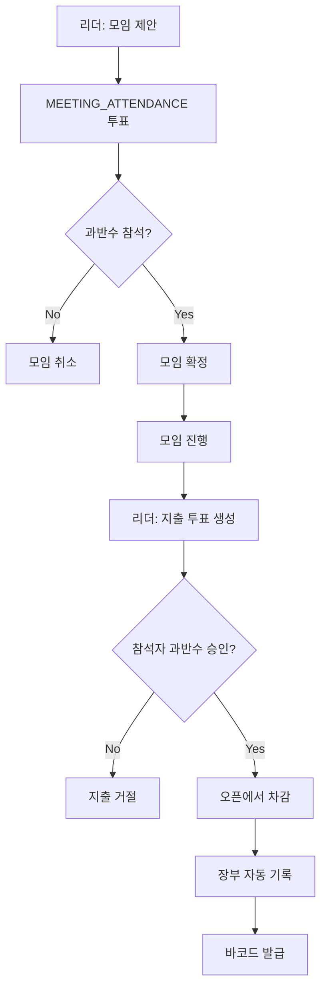

### 2.4 챌린지 해산 플로우 (신규)

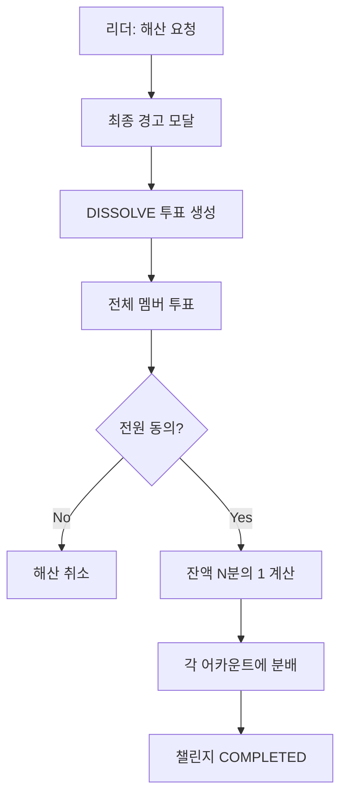

---

## 3. 투표 플로우

### 3.1 투표 타입별 요약

| 타입 | 생성자 | 대상 | 승인 조건 | 결과 |
|------|--------|------|----------|------|
| EXPENSE | 리더 | **참석자만** | 과반수~70% | 오픈 차감 |
| MEETING_ATTENDANCE | 리더 | 전체 | 과반수 | 모임 확정 |
| KICK | 리더/멤버 | 전체 | 70% | 강퇴 |
| LEADER_KICK | 팔로워 | 팔로워만 | 70% | 리더 교체 |
| DISSOLVE | 리더 | 전체 | **100%** | 해산 + 분배 |

### 3.2 투표 상태 전이

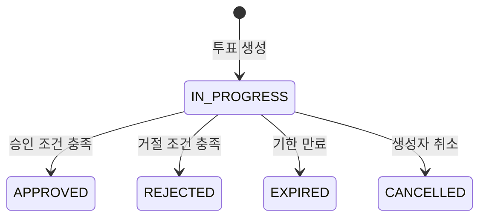

### 3.3 EXPENSE 투표 플로우 (지출 승인)

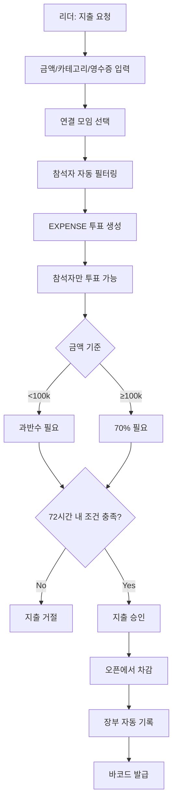

### 3.4 MEETING_ATTENDANCE 투표 플로우 (모임 참석)

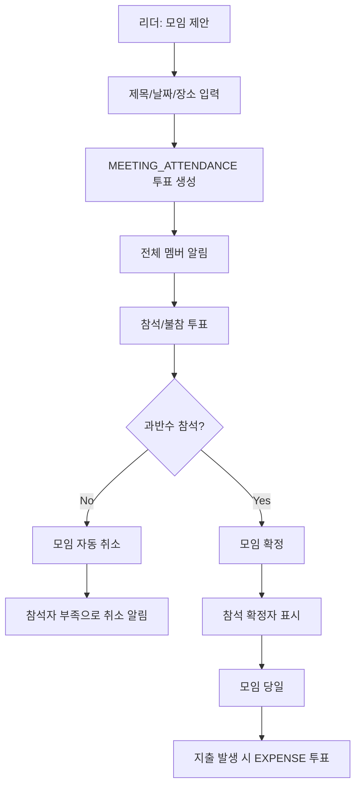

### 3.5 KICK 투표 플로우 (멤버 강퇴)

> 상세 플로우: [UX_FLOW_P0.md#강퇴kick-플로우](./UX_FLOW_P0.md#22-강퇴kick-플로우)

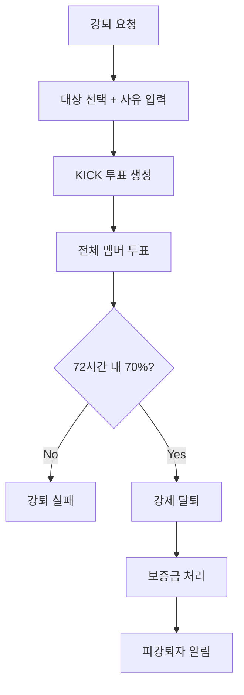

### 3.6 LEADER_KICK 투표 플로우 (리더 탄핵)

> 상세 플로우: [UX_FLOW_P1.md#리더-탄핵leader_kick-플로우](./UX_FLOW_P1.md#21-리더-탄핵leader_kick-플로우)

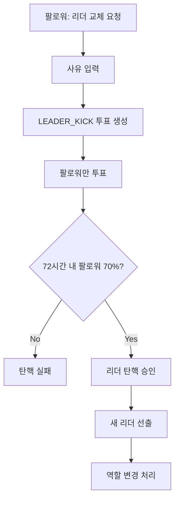

### 3.7 DISSOLVE 투표 플로우 (챌린지 해산)

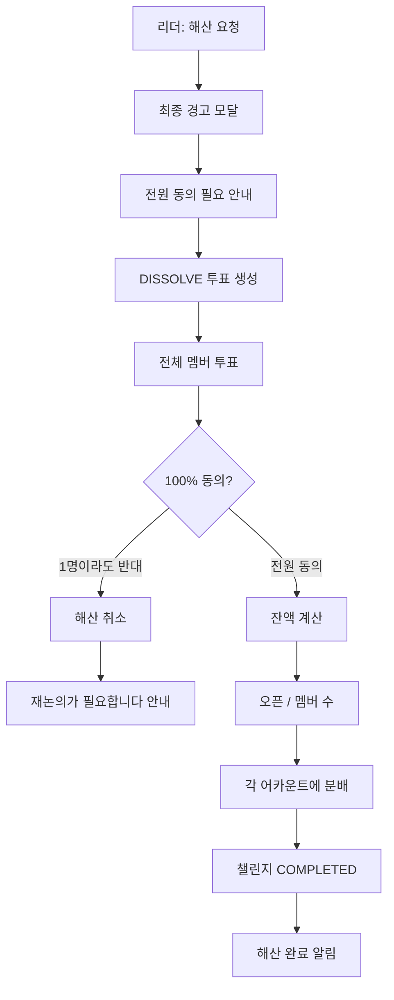

---

## 4. 화면별 진입점 & 이탈점 (신규)

### 4.1 홈 화면

| 진입점 | 이탈점 |
|--------|--------|
| 앱 실행 | 챌린지 상세 (탭) |
| 로그인 완료 | 탐색 (탭) |
| 딥링크 | 마이페이지 (탭) |

### 4.2 챌린지 상세

| 진입점 | 이탈점 |
|--------|--------|
| 홈 GroupCard 탭 | 뒤로가기 (홈) |
| 탐색 검색 결과 탭 | 설정 (모달) |
| 초대 딥링크 | 외부 공유 |
| 푸시 알림 탭 | |

### 4.3 장부 탭

| 진입점 | 이탈점 |
|--------|--------|
| 챌린지 탭 전환 | 거래 상세 (모달) |
| 푸시 알림 | 투표 상세 (연결) |

---

## 5. 화면 상태 정의 (신규)

### 5.1 공통 상태

| 상태 | 트리거 | UI 표현 | 참조 |
|------|--------|---------|------|
| **Loading** | API 호출 중 | Skeleton / Spinner | WDS_FEEDBACK.md |
| **Error** | API 실패 | ErrorState + 재시도 | WDS_FEEDBACK.md |
| **Empty** | 데이터 없음 | EmptyState + CTA | WDS_FEEDBACK.md |
| **Success** | 작업 완료 | Toast / Confetti | WDS_FEEDBACK.md |

### 5.2 화면별 상태

| 화면 | Loading | Error | Empty |
|------|---------|-------|-------|
| **홈** | GroupCard Skeleton × 3 | 새로고침 CTA | "첫 챌린지를 찾아보세요" |
| **팔로우 피드** | PostCard Skeleton × 5 | 재시도 버튼 | "첫 글을 작성해보세요" |
| **장부** | ChartWrapper Skeleton | 재시도 버튼 | "아직 거래 내역이 없어요" |
| **투표** | VoteCard Skeleton × 3 | 재시도 버튼 | "진행 중인 투표가 없어요" |
| **모임** | MeetingCard Skeleton × 3 | 재시도 버튼 | "예정된 모임이 없어요" |

### 5.3 에러 복구 플로우

#### 5.3.1 네트워크 에러 복구

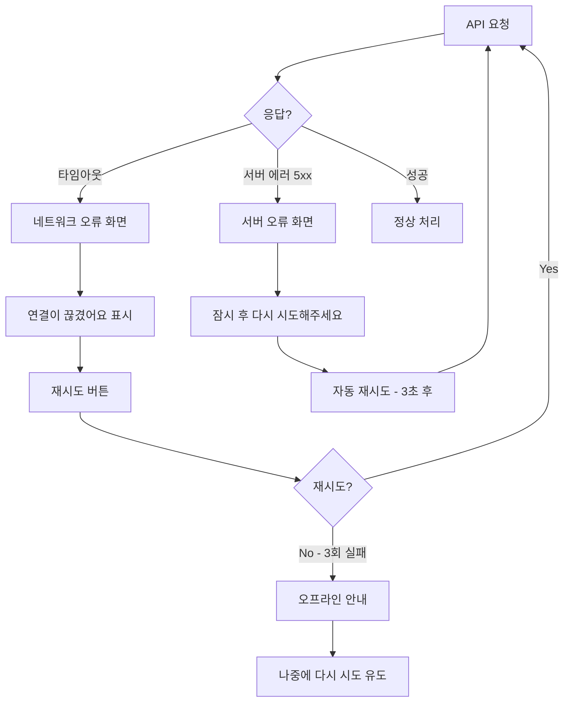

#### 5.3.2 권한/상태 에러 복구

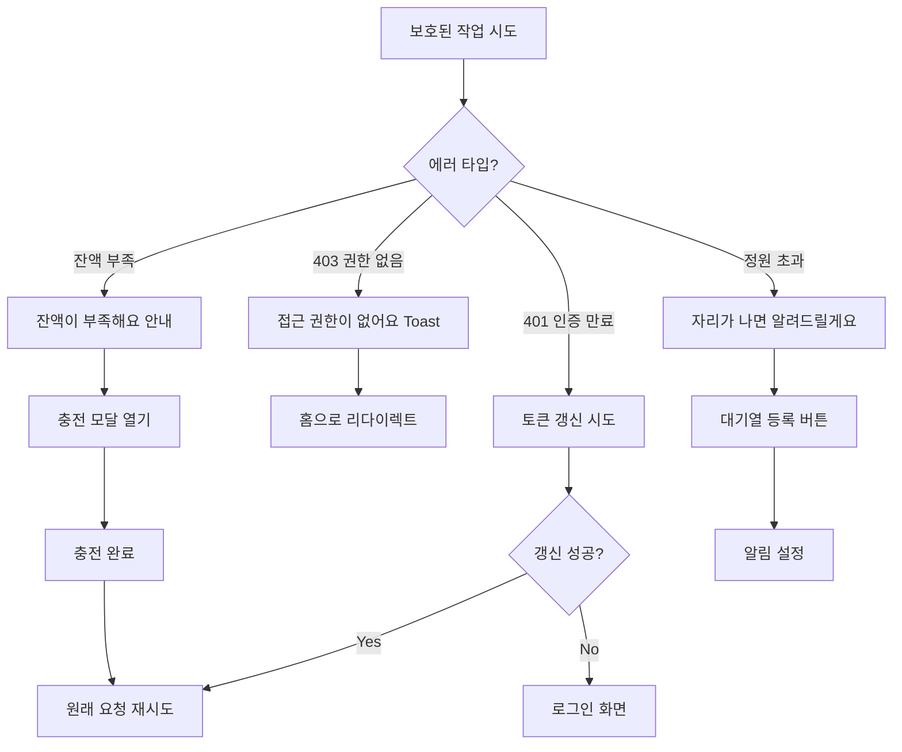

**에러 코드별 마이크로카피:**
| 상황 | 마이크로카피 |
|------|-------------|
| 결제 실패 | "다시 시도해보세요" |
| 네트워크 오류 | "연결이 끊겼어요" |
| 권한 없음 | "접근 권한이 없어요" |
| 잔액 부족 | "잔액이 부족해요" |
| 정원 초과 | "자리가 나면 알려드릴게요" |

---

## 6. 로딩 전략 (신규)

### 6.1 Skeleton 우선 적용 화면

- 홈 (GroupCard 목록)
- 피드 (PostCard 목록)
- 장부 (ChartWrapper + Timeline)
- 모임 (MeetingCard 목록)

### 6.2 Spinner 적용 액션

- 버튼 액션 (결제, 투표, 게시)
- 모달 내 API 호출
- 검색 결과 로딩

---

## 관련 문서

### Phase별 상세 플로우
- [UX_FLOW_P0.md](./UX_FLOW_P0.md) - **P0 Core 플로우** (Demo 필수 7개)
- [UX_FLOW_P1.md](./UX_FLOW_P1.md) - **P1 Essential 플로우** (필수 확장 7개)

### 참조 문서
- [UX_STRATEGY.md](../Strategy/UX_STRATEGY.md) - UX 전략 및 원칙
- [UX_SCENARIOS.md](../Strategy/UX_SCENARIOS.md) - 15개 시나리오
- [UX_EMOTION_MAP.md](../Strategy/UX_EMOTION_MAP.md) - 감정 맵핑
- [WDS_FEEDBACK.md](../../../02_ENGINEERING/Frontend/DesignSystem/WDS_FEEDBACK.md) - 피드백 컴포넌트
- [IA_SPECIFICATION.md](../Architecture/IA_SPECIFICATION.md) - 정보 구조

### API 문서
- [P0_Core_APIs.md](../../../03_DEVOPS/P0_Core_APIs.md) - P0 API 목록
- [P1_Essential_APIs.md](../../../03_DEVOPS/P1_Essential_APIs.md) - P1 API 목록

