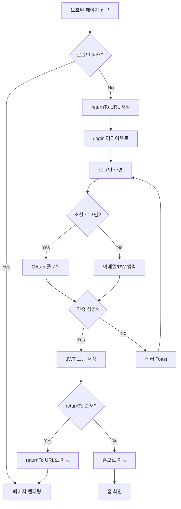
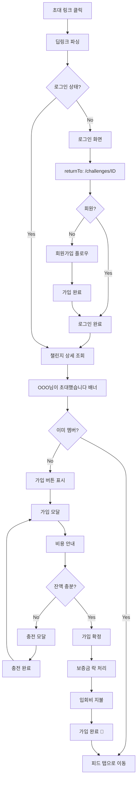
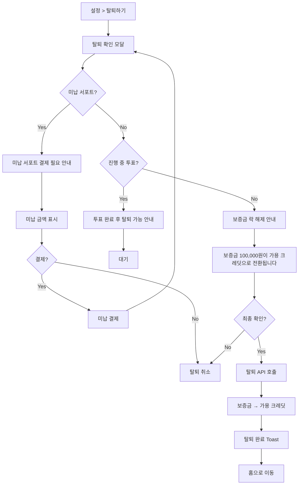
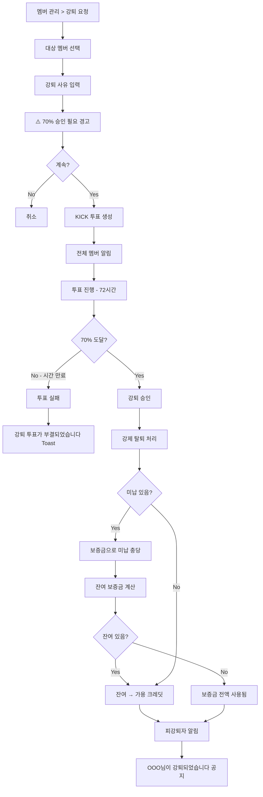
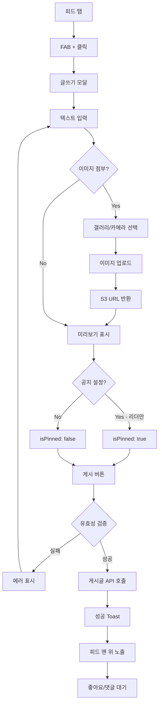
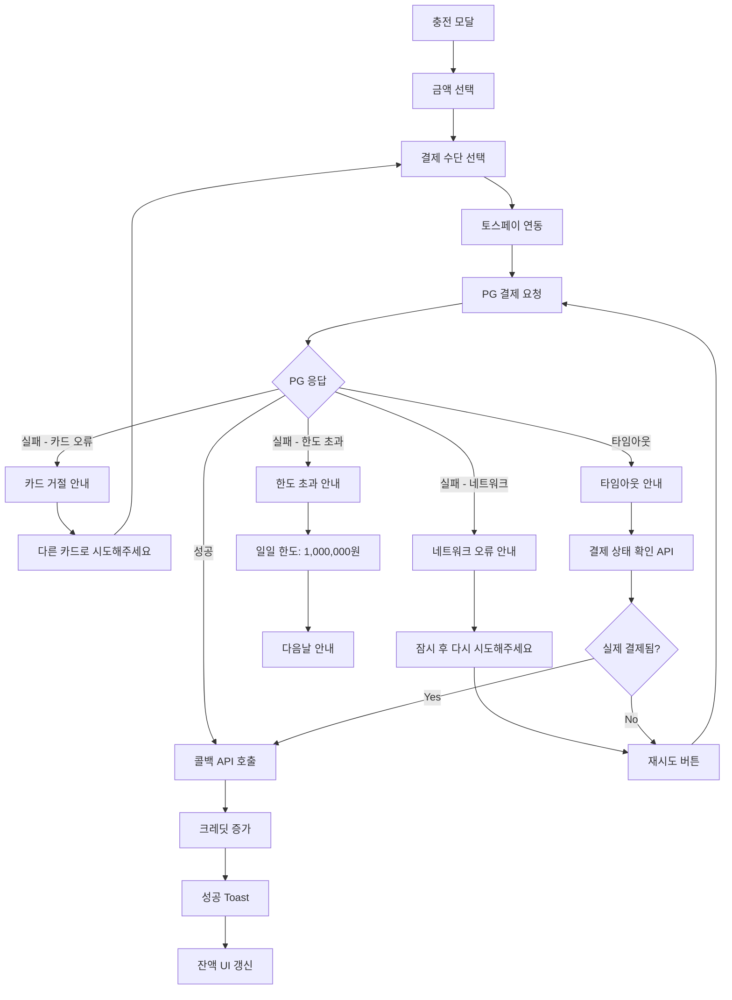

# WOORIDO UX 플로우 - P0 Core (Demo 필수)

> **Purpose:** Demo Day 필수 플로우 정의
> **Last Updated:** 2026-01-21
> **Status:** Draft
> **Phase:** P0 (MVP Core)

---

## 개요

| 항목 | 값 |
|------|-----|
| 총 플로우 수 | 7개 |
| 도메인 | 인증, 챌린지, SNS, 금융 |
| 우선순위 | Demo 필수 |

---

## 1. 인증 도메인 (Auth)

### 1.1 비회원 → 인증 가드 플로우

> **트리거:** 비로그인 상태에서 보호된 페이지 접근
> **연관 API:** `POST /auth/login`
> **연관 시나리오:** S1 (검색 진입 → 첫 챌린지 가입)



**보호된 페이지 목록:**
| 라우터 그룹 | 경로 | 설명 |
|------------|------|------|
| `(main)` | `/` | 홈 (내 챌린지) |
| `(main)` | `/groups/:id/*` | 챌린지 상세 (멤버 뷰) |
| `(main)` | `/mypage/*` | 마이페이지 |
| `(main)` | `/charge`, `/withdraw` | 충전/출금 |

### 1.2 초대 링크 → 챌린지 가입 플로우

> **트리거:** 외부에서 초대 딥링크 클릭
> **연관 API:** `GET /challenges/{id}`, `POST /challenges/{id}/join`
> **연관 시나리오:** S2 (초대 링크로 가입)



**딥링크 형식:**
```
https://woorido.com/invite/{challengeId}?ref={inviterId}
```

---

## 2. 챌린지 도메인 (Challenge)

### 2.1 정상 탈퇴 플로우

> **트리거:** 멤버가 자발적으로 탈퇴 요청
> **연관 API:** `DELETE /challenges/{id}/leave`
> **연관 시나리오:** M3 (챌린지 탈퇴)



**탈퇴 조건 체크리스트:**
| 조건 | 통과 시 | 미통과 시 |
|------|--------|----------|
| 미납 없음 | 다음 단계 | 미납 결제 유도 |
| 진행 중 투표 없음 | 다음 단계 | 대기 안내 |
| 리더가 아님 | 다음 단계 | 권한 위임 선행 필요 |

### 2.2 강퇴(KICK) 플로우

> **트리거:** 리더 또는 멤버가 규칙 위반자 강퇴 요청
> **연관 API:** `POST /challenges/{id}/votes` (type: KICK)
> **연관 시나리오:** L4 (멤버 강퇴 투표)



**KICK 투표 규칙:**
| 항목 | 값 |
|------|-----|
| 발의 가능자 | 리더 또는 멤버 |
| 투표 대상 | 전체 멤버 (본인 제외) |
| 승인 조건 | 70% 이상 |
| 기한 | 72시간 |

---

## 3. SNS 도메인 (Social)

### 3.1 게시글 작성 플로우

> **트리거:** 피드 탭에서 글쓰기 버튼 클릭
> **연관 API:** `POST /challenges/{id}/posts`
> **연관 시나리오:** S4 (첫 피드 게시글 작성)



**게시글 유효성 규칙:**
| 필드 | 규칙 |
|------|------|
| 내용 | 1~2000자 |
| 이미지 | 최대 5장, 각 10MB 이하 |
| 공지 | 리더만 설정 가능 |

### 3.2 댓글/좋아요 플로우

> **트리거:** 게시글에서 상호작용
> **연관 API:** `POST /comments`, `POST /like`

```mermaid
flowchart TD
    subgraph 좋아요
        A1[게시글 카드] --> B1[❤️ 버튼 탭]
        B1 --> C1{이미 좋아요?}
        C1 -->|No| D1[좋아요 API]
        D1 --> E1[하트 애니메이션]
        E1 --> F1[카운트 +1]
        C1 -->|Yes| G1[좋아요 취소 API]
        G1 --> H1[카운트 -1]
    end
    
    subgraph 댓글
        A2[게시글 카드] --> B2[💬 버튼 탭]
        B2 --> C2[댓글 섹션 펼침]
        C2 --> D2[댓글 입력란]
        D2 --> E2[텍스트 입력]
        E2 --> F2[전송 버튼]
        F2 --> G2[댓글 API 호출]
        G2 --> H2[댓글 목록 갱신]
        H2 --> I2[작성자에게 알림]
    end
    
    subgraph 대댓글
        J2[댓글] --> K2[답글 버튼]
        K2 --> L2["@닉네임" 자동 입력]
        L2 --> M2[대댓글 작성]
        M2 --> N2[parentId 설정]
        N2 --> O2[대댓글 API 호출]
    end
```



---

## 4. 금융 도메인 (Finance)

### 4.1 결제 실패/재시도 플로우

> **트리거:** 충전 또는 결제 시 PG 오류 발생
> **연관 API:** `POST /accounts/charge`, `POST /accounts/charge/callback`
> **연관 시나리오:** M1 (잔액 부족 → 충전)



**에러 코드별 처리:**
| 에러 코드 | 원인 | UX 처리 |
|----------|------|---------|
| `CARD_DECLINED` | 카드 거절 | 다른 카드 유도 |
| `NETWORK_ERROR` | 네트워크 | 재시도 버튼 |
| `LIMIT_EXCEEDED` | 한도 초과 | 한도 안내 |
| `TIMEOUT` | 타임아웃 | 상태 확인 후 분기 |

---

## 관련 문서

- [UX_FLOW.md](./UX_FLOW.md) - 핵심 플로우 요약
- [UX_FLOW_P1.md](./UX_FLOW_P1.md) - P1 확장 플로우
- [UX_SCENARIOS.md](../Strategy/UX_SCENARIOS.md) - 시나리오 상세
- [P0_Core_APIs.md](../../../03_DEVOPS/P0_Core_APIs.md) - P0 API 목록
