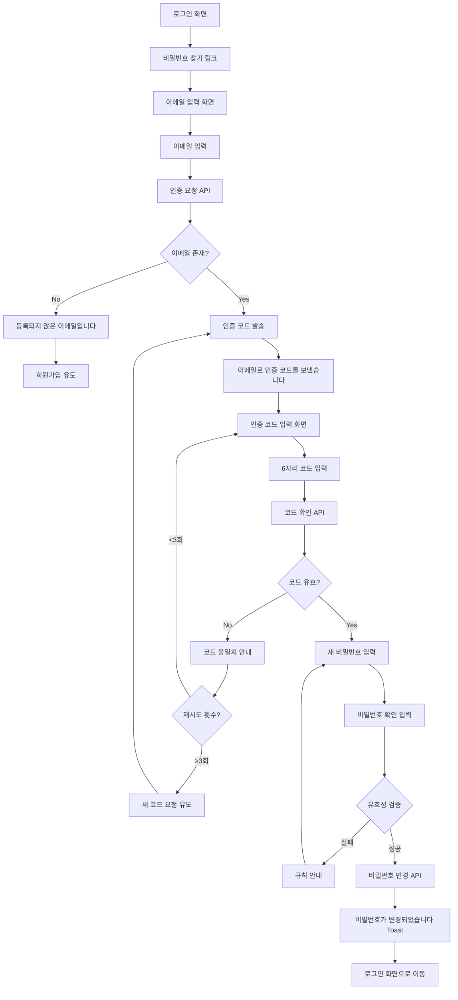
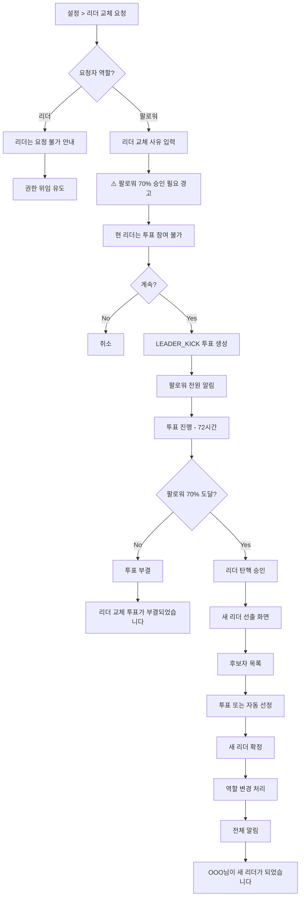
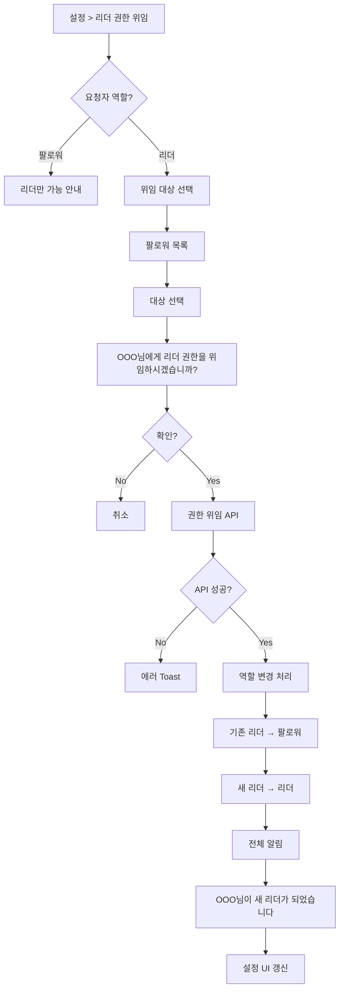
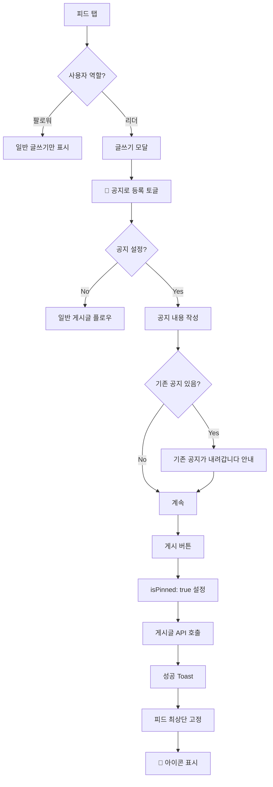
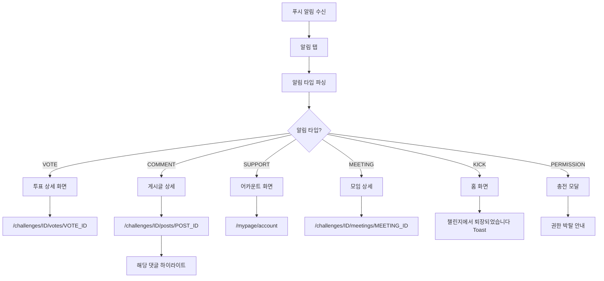
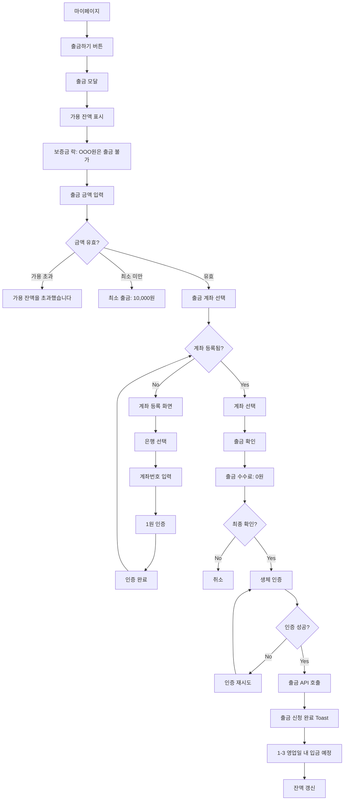
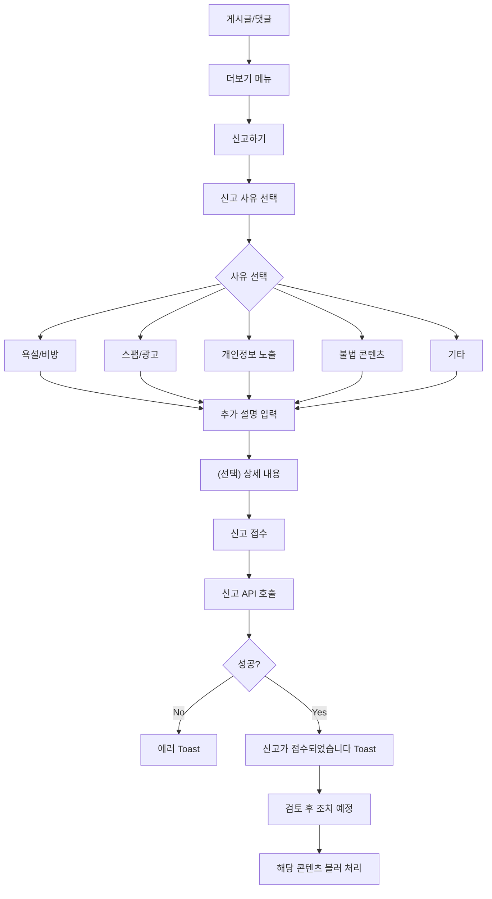

# WOORIDO UX 플로우 - P1 Essential (필수 확장)

> **Purpose:** Demo 후 우선 구현할 필수 확장 플로우
> **Last Updated:** 2026-01-21
> **Status:** Draft
> **Phase:** P1 (Essential Extension)

---

## 개요

| 항목 | 값 |
|------|-----|
| 총 플로우 수 | 7개 |
| 도메인 | 인증, 챌린지, 알림, 금융, 시스템 |
| 우선순위 | Demo 후 우선 |

---

## 1. 인증 도메인 (Auth)

### 1.1 비밀번호 재설정 플로우

> **트리거:** 로그인 화면에서 "비밀번호 찾기" 클릭
> **연관 API:** `POST /auth/password/reset`, `PUT /auth/password/reset`

**비밀번호 규칙:**
| 규칙 | 값 |
|------|-----|
| 길이 | 8-20자 |
| 필수 조합 | 영문 + 숫자 + 특수문자 |
| 특수문자 | `!@#$%^&*()_+-=[]{}|;:,.<>?` |

---

## 2. 챌린지 도메인 (Challenge)

### 2.1 리더 탄핵(LEADER_KICK) 플로우

> **트리거:** 팔로워가 리더 교체 투표 발의
> **연관 API:** `POST /challenges/{id}/votes` (type: LEADER_KICK)

**LEADER_KICK 투표 규칙:**
| 항목 | 값 |
|------|-----|
| 발의 가능자 | 팔로워만 |
| 투표 대상 | 팔로워만 (리더 제외) |
| 승인 조건 | 팔로워의 70% 이상 |
| 새 리더 선정 | 최다 득표 또는 자동 지정 |

### 2.2 리더 권한 위임 플로우

> **트리거:** 리더가 자발적으로 권한 이전
> **연관 API:** `POST /challenges/{id}/delegate`

### 2.3 공지사항 등록 플로우 (리더 전용)

> **트리거:** 리더가 피드에 공지 등록
> **연관 API:** `POST /challenges/{id}/posts` (isPinned: true)

---

## 3. 알림 도메인 (Notification)

### 3.1 푸시 알림 딥링크 플로우

> **트리거:** 푸시 알림 탭
> **연관 API:** `GET /notifications`

**알림 타입별 라우팅:**
| 알림 타입 | 대상 화면 | 추가 액션 |
|----------|----------|----------|
| `VOTE_CREATED` | 투표 상세 | - |
| `VOTE_RESULT` | 투표 상세 | 결과 표시 |
| `COMMENT_NEW` | 게시글 상세 | 댓글 하이라이트 |
| `SUPPORT_PAID` | 어카운트 | 잔액 갱신 |
| `MEETING_CONFIRMED` | 모임 상세 | 참석 확인 |
| `KICKED` | 홈 | Toast 표시 |
| `PERMISSION_REVOKED` | 충전 모달 | 복구 유도 |

---

## 4. 금융 도메인 (Finance)

### 4.1 출금 플로우

> **트리거:** 마이페이지에서 출금 버튼 클릭
> **연관 API:** `POST /accounts/withdraw`

**출금 규칙:**
| 항목 | 값 |
|------|-----|
| 최소 출금 | 10,000원 |
| 최대 출금 | 가용 잔액 전체 |
| 수수료 | 0원 |
| 소요 시간 | 1-3 영업일 |

---

## 5. 시스템 도메인 (System)

### 5.1 콘텐츠 신고 플로우

> **트리거:** 게시글/댓글에서 신고 버튼 클릭
> **연관 API:** `POST /reports`

**신고 사유 코드:**
| 코드 | 사유 | 자동 처리 |
|------|------|----------|
| `ABUSE` | 욕설/비방 | AI 필터링 |
| `SPAM` | 스팸/광고 | 즉시 숨김 |
| `PRIVACY` | 개인정보 노출 | 긴급 검토 |
| `ILLEGAL` | 불법 콘텐츠 | 긴급 검토 |
| `OTHER` | 기타 | 일반 검토 |

---

## 관련 문서

- [UX_FLOW.md](./UX_FLOW.md) - 핵심 플로우 요약
- [UX_FLOW_P0.md](./UX_FLOW_P0.md) - P0 Core 플로우
- [UX_SCENARIOS.md](../Strategy/UX_SCENARIOS.md) - 시나리오 상세
- [P1_Essential_APIs.md](../../../03_DEVOPS/P1_Essential_APIs.md) - P1 API 목록
