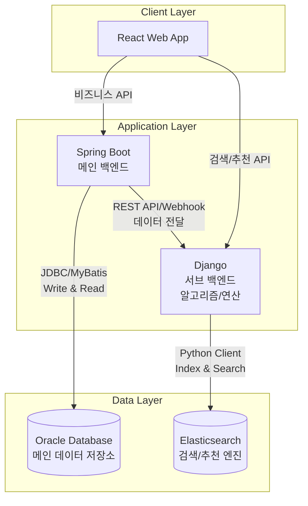
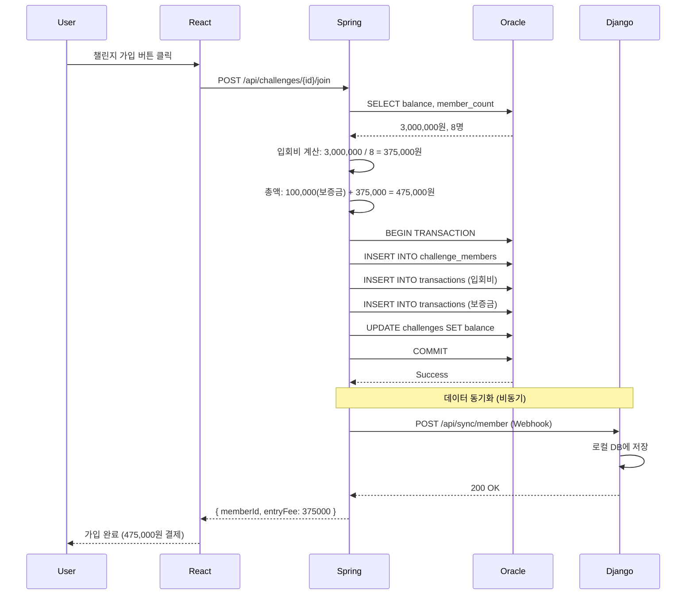
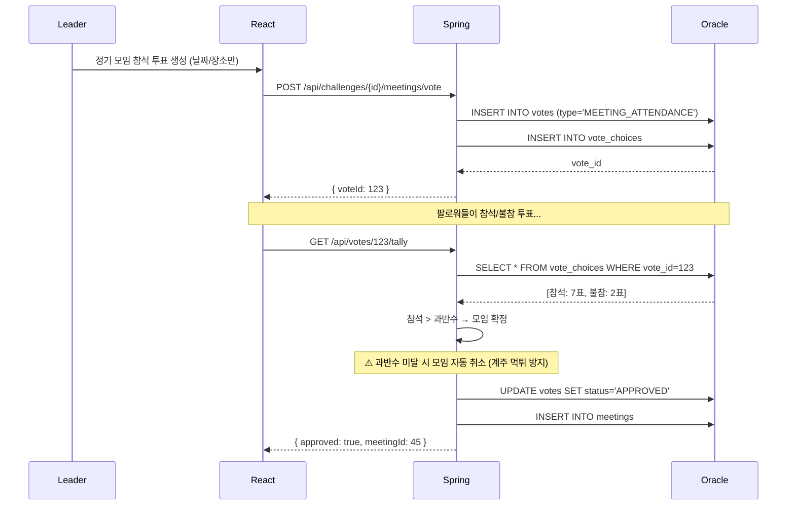
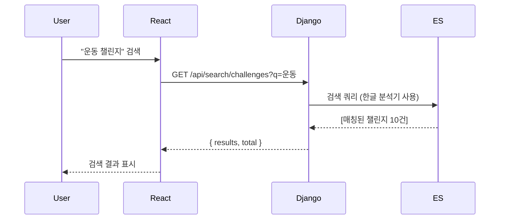
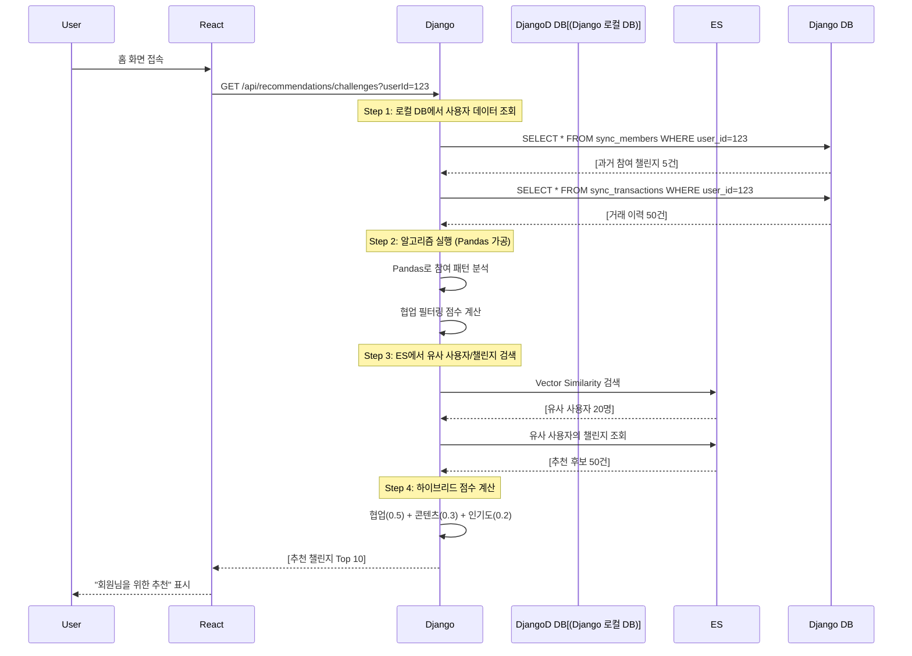
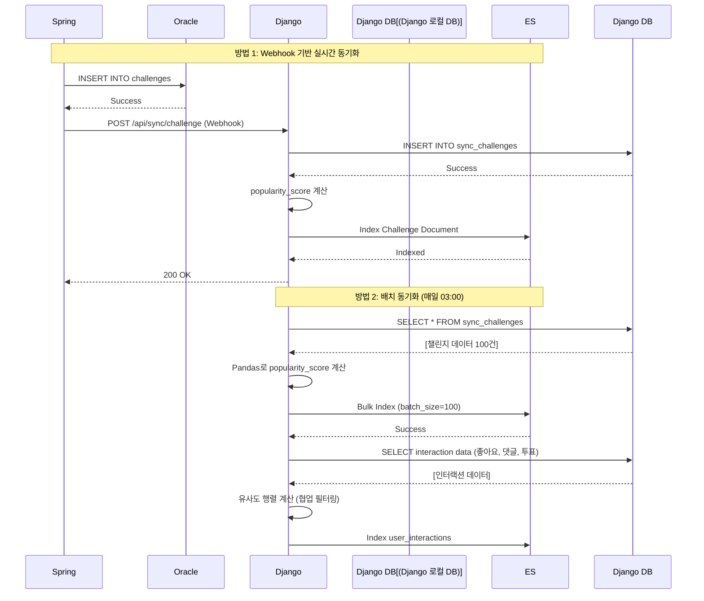
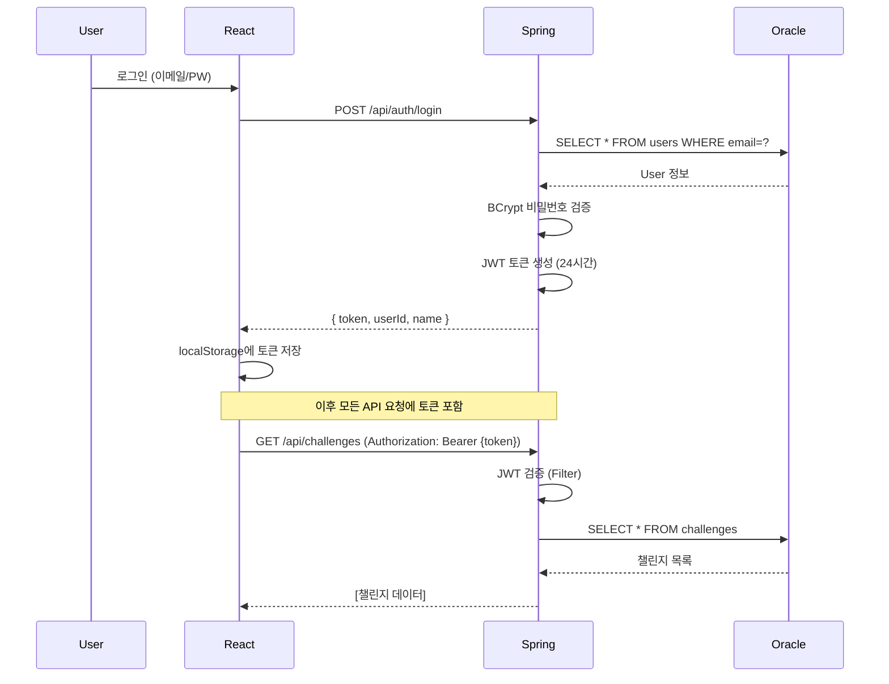

# WOORIDO 시스템 아키텍처

## 1. 전체 아키텍처 개요

### 1.1 시스템 구조도



**핵심 데이터 흐름**:
1. **메인 비즈니스 로직**: React → Spring Boot → Oracle (Write/Read)
2. **데이터 전달**: Spring Boot → Django (REST API 또는 Webhook)
3. **알고리즘/연산**: Django가 Spring Boot로부터 받은 데이터 가공
4. **검색/추천**: Django → Elasticsearch 인덱싱 → Django가 ES 쿼리

**중요**: Django는 Oracle에 직접 연결되지 않음. 모든 데이터는 Spring Boot를 통해 전달받음.

### 1.2 백엔드 역할 분담

| 백엔드 | 역할 | 처리 내용 | 데이터 소스 |
|--------|------|----------|------------|
| **Spring Boot<br/>(메인)** | 비즈니스 로직 | - 챌린지 CRUD<br/>- 투표 처리<br/>- 거래 관리<br/>- 인증/인가<br/>- **Django에 데이터 전달** | Oracle (Write/Read) |
| **Django<br/>(서브)** | 알고리즘/연산/검색 | - Spring Boot로부터 데이터 수신<br/>- 통계 분석<br/>- 추천 알고리즘<br/>- 검색 쿼리<br/>- 리포트 생성 | Spring Boot API<br/>Elasticsearch (Index/Search) |

### 1.3 기술 스택

| 계층 | 기술 | 버전 | 역할 |
|------|------|------|------|
| **Frontend** | React | 18.2.0 | SPA 웹 애플리케이션 |
| | Vite | 5.4.x | 빌드 도구 및 개발 서버 |
| | React Router | 6.x | 클라이언트 라우팅 |
| | Axios | 1.6.5 | HTTP 클라이언트 |
| | Zustand | 4.5.0 | 클라이언트 상태 관리 |
| | React Query | 5.17.19 | 서버 상태 관리 |
| **Main Backend** | Spring Boot | 3.2.3 | 주요 비즈니스 로직 API |
| | Java | 21 (LTS) | Virtual Threads 지원 |
| | MyBatis | 3.0.3 | SQL 매핑 프레임워크 |
| | Spring Security | 6.x | 인증/인가 |
| | Spring Retry | 2.0.5 | 외부 서비스 재시도 |
| | RestTemplate/WebClient | - | Django 호출용 |
| **Sub Backend** | Django | 5.0.1 | 알고리즘/연산/검색 |
| | Django REST Framework | 3.14.0 | REST API 구성 |
| | Pandas | 2.1.4 | 데이터 분석 |
| | Elasticsearch-py | 8.11.1 | ES 클라이언트 |
| **Database** | Oracle Database | 21c XE | 메인 데이터베이스 |
| **Search/Analytics** | Elasticsearch | 8.11.3 | 검색 및 추천 엔진 |
| **Infra** | Docker | Latest | 컨테이너화 |
| | Nginx | 1.25.3 | 리버스 프록시 |

## 2. 3-Tier 아키텍처

### 2.1 Presentation Tier (프론트엔드)

```
React Application
├── Pages (라우트별 페이지)
│   ├── ChallengeListPage
│   ├── ChallengeDetailPage
│   ├── FeedPage
│   ├── LedgerPage
│   └── SearchPage (신규)
├── Components (재사용 컴포넌트)
│   ├── ChallengeCard
│   ├── VotePanel
│   ├── CommentList
│   ├── SearchBar (신규)
│   └── RecommendationPanel (신규)
├── Services (API 통신)
│   ├── challengeService.js (→ Spring Boot)
│   ├── voteService.js (→ Spring Boot)
│   ├── ledgerService.js (→ Django)
│   └── searchService.js (→ Django, 신규)
└── Store (상태 관리)
    ├── authStore
    └── challengeStore
```

**주요 책임**:
- 사용자 인터페이스 렌더링
- 사용자 입력 검증
- API 호출 (Spring Boot 또는 Django)
- 클라이언트 상태 관리

### 2.2 Application Tier (백엔드)

#### Spring Boot (메인 백엔드)

```
Spring Boot Application
├── Controller Layer (REST API)
│   ├── ChallengeController
│   │   ├── POST /api/challenges (챌린지 생성)
│   │   ├── POST /api/challenges/{id}/join (가입)
│   │   └── GET /api/challenges (목록 조회)
│   ├── VoteController
│   │   ├── POST /api/votes (투표 생성)
│   │   ├── POST /api/votes/{id}/cast (투표하기)
│   │   └── GET /api/votes/{id}/tally (집계)
│   ├── LedgerController
│   │   └── GET /api/ledger/{id} (거래 내역)
│   ├── MeetingController
│   │   ├── POST /api/meetings (모임 생성)
│   │   └── POST /api/meetings/{id}/attend (참석 등록)
│   └── SyncController (Django 연동용, 신규)
│       ├── POST /api/sync/challenge (챌린지 데이터 전달)
│       └── POST /api/sync/transaction (거래 데이터 전달)
├── Service Layer (비즈니스 로직)
│   ├── ChallengeService
│   │   ├── createChallenge()
│   │   ├── joinChallenge()
│   │   ├── calculateEntryFee()
│   │   └── syncToDjango() (Django 호출, 신규)
│   ├── VoteService
│   │   ├── createVote()
│   │   ├── castVote()
│   │   └── tallyVotes()
│   ├── TransactionService
│   │   ├── processPayment()
│   │   ├── refundDeposit()
│   │   └── syncToDjango() (Django 호출, 신규)
│   └── DjangoSyncService (신규)
│       ├── sendChallengeData()
│       └── sendTransactionData()
├── Repository Layer (데이터 접근)
│   ├── ChallengeMapper (MyBatis)
│   ├── VoteMapper
│   └── TransactionMapper
└── Domain Layer (엔티티)
    ├── Challenge
    ├── Vote
    └── Transaction
```

**주요 책임**:
- RESTful API 제공 (CRUD 중심)
- 비즈니스 로직 실행 (챌린지 생성, 투표, 거래 처리)
- 트랜잭션 관리 (Oracle Write)
- 인증/인가 처리 (JWT)
- **Django에 데이터 전달 (REST API 호출 또는 Webhook)**

#### Django (서브 백엔드 - 알고리즘/연산/검색)

```
Django Application
├── sync/
│   ├── views.py (Spring Boot 데이터 수신 API)
│   │   ├── ReceiveChallengeView (POST /api/sync/challenge)
│   │   ├── ReceiveTransactionView (POST /api/sync/transaction)
│   │   └── ReceiveMemberView (POST /api/sync/member)
│   └── models.py (Django 로컬 모델 - Spring Boot 데이터 저장)
│       ├── Challenge
│       ├── Transaction
│       └── Member
├── analytics/
│   ├── views.py (분석 API)
│   │   ├── ChallengeSummaryView
│   │   ├── UserParticipationView
│   │   └── LedgerAnalysisView
│   ├── processors.py (데이터 가공)
│   │   ├── calculate_statistics()
│   │   ├── aggregate_transactions()
│   │   └── compute_trends()
│   └── tasks.py (Celery Background Tasks)
│       └── sync_to_elasticsearch()
├── search/
│   ├── views.py (검색 API)
│   │   ├── ChallengeSearchView
│   │   ├── UserSearchView
│   │   └── FeedSearchView
│   ├── indexers.py (ES 인덱서)
│   │   ├── ChallengeIndexer.index_from_local()
│   │   ├── FeedIndexer.index_from_local()
│   │   └── UserIndexer.index_from_local()
│   └── queries.py (ES 쿼리 빌더)
│       ├── build_challenge_query()
│       └── build_autocomplete_query()
├── recommendations/
│   ├── views.py (추천 API)
│   │   ├── PersonalizedChallengeView
│   │   └── SimilarUserView
│   ├── algorithms.py (추천 알고리즘)
│   │   ├── CollaborativeFiltering
│   │   │   └── compute_user_similarity()
│   │   ├── ContentBasedFiltering
│   │   │   └── compute_challenge_similarity()
│   │   └── HybridRecommender
│   │       └── calculate_hybrid_score()
│   └── scorers.py (점수 계산)
│       ├── UserSimilarityScorer
│       └── ChallengePopularityScorer
└── reports/
    ├── generators.py (리포트 생성)
    │   ├── generate_pdf_report()
    │   └── generate_csv_export()
    └── visualizers.py (차트 생성)
        └── create_matplotlib_charts()
```

**주요 책임**:
- **Spring Boot로부터 데이터 수신** (REST API 엔드포인트)
- **알고리즘 실행** (추천, 유사도 계산, 통계 분석)
- **데이터 가공 및 집계** (Pandas 활용)
- **Elasticsearch 인덱싱** (가공된 데이터 저장)
- **검색 쿼리 실행** (ES Python Client 사용)
- **리포트 생성** (PDF/CSV)

### 2.3 Data Tier (데이터베이스 & 검색 엔진)

#### Oracle Database (메인 데이터 저장소)

**주요 테이블**:
- `CHALLENGES`: 챌린지 마스터
- `CHALLENGE_MEMBERS`: 멤버십
- `VOTES`: 투표
- `VOTE_CHOICES`: 투표 선택지
- `TRANSACTIONS`: 거래 원장
- `MEETINGS`: 정기 모임 (신규)
- `FEED_POSTS`: SNS 피드
- `COMMENTS`: 댓글

**접근 패턴**:
- **Spring Boot만 직접 접근** (Read/Write)
- **Django는 접근하지 않음** (Spring Boot를 통해 데이터 수신)

**주요 뷰**:
- `GYE AS SELECT * FROM CHALLENGES` (용어 변경 대응)
- `ACTIVE_MEMBERS`: 활성 멤버 조회

#### Elasticsearch (검색/추천 엔진)

**인덱스 구조**:

```json
// challenges 인덱스 (Django가 로컬 DB에서 인덱싱)
{
  "mappings": {
    "properties": {
      "challenge_id": { "type": "keyword" },
      "title": { "type": "text", "analyzer": "korean" },
      "description": { "type": "text", "analyzer": "korean" },
      "category": { "type": "keyword" },
      "leader_name": { "type": "text" },
      "member_count": { "type": "integer" },
      "balance": { "type": "long" },
      "participation_fee": { "type": "long" },
      "deposit": { "type": "long" },
      "status": { "type": "keyword" },
      "created_at": { "type": "date" },
      "popularity_score": { "type": "float" },
      "tags": { "type": "keyword" }
    }
  }
}

// feed_posts 인덱스
{
  "mappings": {
    "properties": {
      "post_id": { "type": "keyword" },
      "challenge_id": { "type": "keyword" },
      "user_id": { "type": "keyword" },
      "content": { "type": "text", "analyzer": "korean" },
      "likes_count": { "type": "integer" },
      "comments_count": { "type": "integer" },
      "created_at": { "type": "date" },
      "engagement_score": { "type": "float" }
    }
  }
}

// user_interactions 인덱스 (Django가 알고리즘으로 생성)
{
  "mappings": {
    "properties": {
      "user_id": { "type": "keyword" },
      "challenge_id": { "type": "keyword" },
      "interaction_type": { "type": "keyword" },
      "interaction_score": { "type": "float" },
      "timestamp": { "type": "date" }
    }
  }
}
```

**한글 분석기 설정**:
```json
{
  "settings": {
    "analysis": {
      "analyzer": {
        "korean": {
          "type": "custom",
          "tokenizer": "nori_tokenizer",
          "filter": ["lowercase", "nori_part_of_speech"]
        }
      }
    }
  }
}
```

**접근 패턴**:
- **Django만 접근** (Spring Boot는 ES에 직접 접근하지 않음)
- Django가 로컬 DB 데이터 → 가공 → ES 인덱싱
- Django가 ES 쿼리 실행 → React에 결과 반환

## 3. 주요 데이터 플로우

### 3.1 챌린지 가입 (입회비 포함) - Spring Boot 처리



**트랜잭션 격리 레벨**: READ_COMMITTED
**락 전략**: Optimistic Locking (version 컬럼 사용)

### 3.2 정기 모임 참석 투표 - Spring Boot 처리



### 3.3 검색 기능 - Django가 ES 쿼리



### 3.4 추천 알고리즘 - Django가 로컬 DB + ES 활용

> [!IMPORTANT]
> **[PostDemo 기능]** 이 섹션의 Django 로컬 DB (PostgreSQL) 및 sync_* 테이블은 MVP/DemoDay 이후에 적용됩니다.
> MVP 시점에는 Django가 DB 연결 없이 Spring Boot API 응답 데이터만 활용하여 분석/추천합니다.



### 3.5 데이터 동기화 (Oracle → Spring Boot → Django → Elasticsearch)

> [!IMPORTANT]
> **[PostDemo 기능]** 이 섹션의 Django 로컬 DB 동기화 아키텍처는 MVP/DemoDay 이후에 적용됩니다.
> MVP 시점에는 Django가 Spring Boot API를 실시간 호출하여 필요한 데이터를 가져옵니다 (로컬 DB 캐싱 없음).



### 3.6 Spring Boot → Django 데이터 전달 방법

#### 방법 1: REST API Webhook (실시간)

```java
// Spring Boot: DjangoSyncService.java

@Service
public class DjangoSyncService {

    @Value("${django.api.url}")
    private String djangoApiUrl;  // http://django:8001

    private final RestTemplate restTemplate;

    public void syncChallenge(Challenge challenge) {
        String url = djangoApiUrl + "/api/sync/challenge";

        ChallengeDTO dto = ChallengeDTO.builder()
            .challengeId(challenge.getId())
            .title(challenge.getTitle())
            .description(challenge.getDescription())
            .memberCount(challenge.getMembers().size())
            .balance(challenge.getBalance())
            .build();

        try {
            restTemplate.postForEntity(url, dto, String.class);
            log.info("Synced challenge {} to Django", challenge.getId());
        } catch (Exception e) {
            log.error("Failed to sync to Django: {}", e.getMessage());
            // 실패 시 재시도 큐에 추가 (향후 확장)
        }
    }

    public void syncTransaction(Transaction transaction) {
        String url = djangoApiUrl + "/api/sync/transaction";
        // 유사한 방식으로 전달
    }
}
```

```python
# Django: sync/views.py

from rest_framework.views import APIView
from rest_framework.response import Response
from .models import Challenge

class ReceiveChallengeView(APIView):
    """
    Spring Boot로부터 챌린지 데이터 수신
    """
    def post(self, request):
        data = request.data

        # Django 로컬 DB에 저장
        Challenge.objects.update_or_create(
            challenge_id=data['challengeId'],
            defaults={
                'title': data['title'],
                'description': data['description'],
                'member_count': data['memberCount'],
                'balance': data['balance'],
                'synced_at': timezone.now()
            }
        )

        # 비동기 태스크: Elasticsearch 인덱싱
        sync_to_elasticsearch.delay(data['challengeId'])

        return Response({'status': 'ok'})
```

#### 방법 2: 배치 API (정기 동기화)

```java
// Spring Boot: SyncController.java

@RestController
@RequestMapping("/api/sync")
public class SyncController {

    @Autowired
    private ChallengeService challengeService;

    /**
     * Django가 주기적으로 호출하여 최신 데이터 가져가기
     */
    @GetMapping("/challenges/updated")
    public ResponseEntity<List<ChallengeDTO>> getUpdatedChallenges(
        @RequestParam("since") LocalDateTime since
    ) {
        List<Challenge> challenges = challengeService.findUpdatedSince(since);
        List<ChallengeDTO> dtos = challenges.stream()
            .map(ChallengeDTO::from)
            .collect(Collectors.toList());

        return ResponseEntity.ok(dtos);
    }
}
```

```python
# Django: sync/tasks.py (Celery)

@shared_task
def fetch_updated_data():
    """
    Spring Boot API 호출하여 최신 데이터 가져오기
    """
    last_sync = get_last_sync_time()  # 마지막 동기화 시각
    url = f"http://spring-boot:8000/api/sync/challenges/updated?since={last_sync}"

    response = requests.get(url)
    challenges = response.json()

    for challenge_data in challenges:
        Challenge.objects.update_or_create(
            challenge_id=challenge_data['challengeId'],
            defaults={...}
        )

    # Elasticsearch 인덱싱
    index_to_elasticsearch(challenges)
```

## 4. 검색 기능 상세 (Django + Elasticsearch)

### 4.1 검색 API 엔드포인트

| 엔드포인트 | 기능 | Django 처리 | Elasticsearch 쿼리 |
|-----------|------|------------|-------------------|
| `GET /api/search/challenges` | 챌린지 검색 | ES 쿼리 빌드 | Multi-match (title, description, tags) |
| `GET /api/search/users` | 사용자 검색 | ES 쿼리 빌드 | Match (name, bio) |
| `GET /api/search/feeds` | 피드 검색 | ES 쿼리 빌드 + 시간 가중치 | Match (content) + Function Score |
| `GET /api/search/autocomplete` | 자동완성 | ES Prefix 쿼리 | Prefix query + Edge N-gram |

### 4.2 검색 쿼리 예시

```python
# Django search/queries.py

from elasticsearch import Elasticsearch

es_client = Elasticsearch(['http://elasticsearch:9200'])

def search_challenges(keyword, filters):
    """
    Django가 로컬 DB 데이터를 미리 인덱싱해둔 ES에서 검색
    """
    query = {
        "bool": {
            "must": [
                {
                    "multi_match": {
                        "query": keyword,
                        "fields": ["title^3", "description^2", "tags"],
                        "type": "best_fields",
                        "analyzer": "korean"
                    }
                }
            ],
            "filter": []
        }
    }

    # 필터 적용
    if filters.get('category'):
        query['bool']['filter'].append({
            "term": {"category": filters['category']}
        })

    if filters.get('status'):
        query['bool']['filter'].append({
            "term": {"status": filters['status']}
        })

    # 인기도 점수로 정렬
    return es_client.search(
        index="challenges",
        body={
            "query": query,
            "sort": [
                {"popularity_score": "desc"},
                "_score"
            ],
            "size": 20
        }
    )
```

## 5. 추천 시스템 상세 (Django 알고리즘 + Elasticsearch)

> [!IMPORTANT]
> **[PostDemo 기능]** 이 섹션의 Django 로컬 DB (sync_members, sync_transactions 등) 기반 추천 시스템은 MVP/DemoDay 이후에 적용됩니다.
> MVP 시점에는 Django가 Spring Boot API 호출을 통해 실시간으로 데이터를 받아 분석합니다.

### 5.1 추천 알고리즘 파이프라인

```
1. 사용자 프로필 생성 (Django 로컬 DB에서 추출)
   ├── Django가 로컬 DB 쿼리 실행
   ├── 참여 이력 (sync_members)
   ├── 투표 패턴 (sync_votes)
   └── 인터랙션 (sync_likes, sync_comments)

2. 협업 필터링 (Django 알고리즘 + Elasticsearch)
   ├── Django: Pandas로 유사도 행렬 계산
   ├── ES: Vector Similarity로 유사 사용자 검색
   └── ES: 유사 사용자들의 참여 챌린지 조회

3. 콘텐츠 기반 필터링 (Elasticsearch)
   ├── Django: 로컬 DB에서 선호 카테고리/태그 추출
   ├── ES: More Like This 쿼리
   └── ES: Term Similarity로 유사 챌린지 검색

4. 하이브리드 점수 계산 (Django)
   ├── 협업 필터링 점수 × 0.5
   ├── 콘텐츠 기반 점수 × 0.3
   └── 인기도 점수 × 0.2 (ES에서 집계)

5. 랭킹 및 반환
   └── Top 10 추천
```

### 5.2 추천 알고리즘 구현 예시

```python
# Django recommendations/algorithms.py

import pandas as pd
from elasticsearch import Elasticsearch
from sync.models import Member, Transaction  # Django 로컬 DB 모델

es_client = Elasticsearch(['http://elasticsearch:9200'])

class HybridRecommender:
    def __init__(self, user_id):
        self.user_id = user_id

    def get_recommendations(self, count=10):
        # Step 1: Django 로컬 DB에서 사용자 프로필 로드
        user_profile = self._load_user_profile_from_local_db()

        # Step 2: 협업 필터링 (Django 알고리즘 + ES)
        cf_scores = self._collaborative_filtering(user_profile)

        # Step 3: 콘텐츠 기반 필터링 (ES)
        cbf_scores = self._content_based_filtering(user_profile)

        # Step 4: 인기도 점수 (ES aggregation)
        popularity_scores = self._get_popularity_from_es()

        # Step 5: 하이브리드 점수 계산 (Django)
        hybrid_scores = {}
        for challenge_id in set(cf_scores.keys()) | set(cbf_scores.keys()):
            hybrid_scores[challenge_id] = (
                cf_scores.get(challenge_id, 0) * 0.5 +
                cbf_scores.get(challenge_id, 0) * 0.3 +
                popularity_scores.get(challenge_id, 0) * 0.2
            )

        # Step 6: 정렬 및 반환
        ranked = sorted(hybrid_scores.items(), key=lambda x: x[1], reverse=True)
        return [challenge_id for challenge_id, score in ranked[:count]]

    def _load_user_profile_from_local_db(self):
        """
        Django 로컬 DB에서 사용자 데이터 추출
        (Spring Boot가 동기화한 데이터)
        """
        # 참여 이력 (Django 로컬 DB)
        memberships = Member.objects.filter(
            user_id=self.user_id
        ).values('challenge_id', 'joined_at')

        # 거래 이력 (Django 로컬 DB)
        transactions = Transaction.objects.filter(
            user_id=self.user_id
        ).values('challenge_id', 'amount')

        # Pandas로 가공
        df_memberships = pd.DataFrame(list(memberships))
        df_transactions = pd.DataFrame(list(transactions))

        return {
            'participated_challenges': df_memberships['challenge_id'].tolist(),
            'preferred_categories': self._extract_categories(df_memberships),
            'avg_participation_fee': df_transactions['amount'].mean()
        }

    def _collaborative_filtering(self, user_profile):
        """
        Django: 로컬 DB 데이터 기반 유사도 계산
        ES: 유사 사용자 검색
        """
        # ES에서 유사 사용자 검색 (Vector Similarity)
        similar_users = es_client.search(
            index="user_interactions",
            body={
                "query": {
                    "more_like_this": {
                        "fields": ["challenge_id"],
                        "like": [{"_id": self.user_id}],
                        "min_term_freq": 1,
                        "min_doc_freq": 2
                    }
                },
                "size": 20
            }
        )

        # 유사 사용자들이 참여한 챌린지 수집 (ES에서 조회)
        candidate_challenges = {}
        for user in similar_users['hits']['hits']:
            user_challenges = es_client.search(
                index="user_interactions",
                body={
                    "query": {"term": {"user_id": user['_id']}},
                    "size": 100
                }
            )

            for hit in user_challenges['hits']['hits']:
                challenge_id = hit['_source']['challenge_id']
                score = hit['_score'] * user['_score']
                candidate_challenges[challenge_id] = \
                    candidate_challenges.get(challenge_id, 0) + score

        return candidate_challenges

    def _content_based_filtering(self, user_profile):
        """
        ES More Like This 쿼리로 유사 챌린지 검색
        """
        user_categories = user_profile['preferred_categories']

        # ES에서 유사한 챌린지 검색
        similar_challenges = es_client.search(
            index="challenges",
            body={
                "query": {
                    "bool": {
                        "should": [
                            {"terms": {"category": user_categories, "boost": 2}},
                            {
                                "more_like_this": {
                                    "fields": ["description", "tags"],
                                    "like": [
                                        {"_index": "challenges", "_id": cid}
                                        for cid in user_profile['participated_challenges']
                                    ]
                                }
                            }
                        ]
                    }
                }
            }
        )

        scores = {}
        for hit in similar_challenges['hits']['hits']:
            scores[hit['_id']] = hit['_score']

        return scores

    def _get_popularity_from_es(self):
        """
        ES aggregation으로 인기도 점수 조회
        """
        result = es_client.search(
            index="challenges",
            body={
                "size": 0,
                "aggs": {
                    "popular_challenges": {
                        "terms": {
                            "field": "challenge_id",
                            "order": {"avg_score": "desc"},
                            "size": 100
                        },
                        "aggs": {
                            "avg_score": {
                                "avg": {"field": "popularity_score"}
                            }
                        }
                    }
                }
            }
        )

        scores = {}
        for bucket in result['aggregations']['popular_challenges']['buckets']:
            scores[bucket['key']] = bucket['avg_score']['value']

        return scores
```

### 5.3 인덱싱 프로세스 (Django 로컬 DB → Elasticsearch)

> [!IMPORTANT]
> **[PostDemo 기능]** Django 로컬 DB 기반 인덱싱은 MVP/DemoDay 이후 적용됩니다.

```python
# Django search/indexers.py

from elasticsearch import Elasticsearch
from sync.models import Challenge  # Django 로컬 DB 모델

es_client = Elasticsearch(['http://elasticsearch:9200'])

class ChallengeIndexer:
    """
    Django가 로컬 DB 데이터를 ES에 인덱싱
    """

    @staticmethod
    def index_from_local_db():
        """
        Django 로컬 DB에서 챌린지 데이터를 읽어 ES에 인덱싱
        (Spring Boot가 동기화한 데이터)
        """
        # Django ORM으로 로컬 DB 데이터 조회
        challenges = Challenge.objects.filter(deleted_at__isnull=True)

        bulk_data = []
        for challenge in challenges:
            # popularity_score 계산 (Django 알고리즘)
            popularity_score = ChallengeIndexer._calculate_popularity(challenge)

            # ES 문서 생성
            doc = {
                "_index": "challenges",
                "_id": challenge.challenge_id,
                "_source": {
                    "challenge_id": challenge.challenge_id,
                    "title": challenge.title,
                    "description": challenge.description,
                    "category": challenge.category,
                    "leader_name": challenge.leader_name,
                    "member_count": challenge.member_count,
                    "balance": challenge.balance,
                    "participation_fee": challenge.participation_fee,
                    "deposit": challenge.deposit,
                    "status": challenge.status,
                    "created_at": challenge.created_at.isoformat(),
                    "popularity_score": popularity_score,
                    "tags": challenge.tags.split(',') if challenge.tags else []
                }
            }
            bulk_data.append(doc)

        # Bulk 인덱싱
        if bulk_data:
            from elasticsearch.helpers import bulk
            bulk(es_client, bulk_data)
            print(f"Indexed {len(bulk_data)} challenges")

    @staticmethod
    def _calculate_popularity(challenge):
        """
        Django에서 인기도 점수 계산 알고리즘
        (로컬 DB 데이터 기반)
        """
        # Django 로컬 DB에서 관련 데이터 조회
        from sync.models import Member, FeedPost, Vote

        member_count = Member.objects.filter(
            challenge_id=challenge.challenge_id
        ).count()

        feed_count = FeedPost.objects.filter(
            challenge_id=challenge.challenge_id
        ).count()

        vote_count = Vote.objects.filter(
            challenge_id=challenge.challenge_id
        ).count()

        member_count_score = member_count * 10
        feed_count_score = feed_count * 5
        vote_count_score = vote_count * 3

        return member_count_score + feed_count_score + vote_count_score
```

## 6. 보안 아키텍처

### 6.1 인증/인가 흐름



### 6.2 보안 계층

| 계층 | 보안 메커니즘 |
|------|--------------|
| **Frontend** | - XSS 방지: React의 자동 이스케이핑<br>- HTTPS 전용 통신 |
| **API Gateway** | - CORS 설정 (화이트리스트)<br>- Rate Limiting (100 req/min) |
| **Spring Boot** | - JWT 토큰 기반 인증<br>- Role-based Access Control (리더/팔로워)<br>- Input Validation (Bean Validation)<br>- Prepared Statements (SQL Injection 방지) |
| **Django** | - Django CSRF Protection<br>- Spring Boot 인증 토큰 검증 (선택적)<br>- ES: 내부망 전용 접근 |
| **Oracle** | - 비밀번호 BCrypt 해싱<br>- Row-level Security<br>- Spring Boot만 접근 (Django 접근 차단) |
| **Elasticsearch** | - X-Pack Security (인증)<br>- Django만 접근 허용 (IP 화이트리스트)<br>- 외부 노출 차단 |

## 7. 확장성 및 성능

### 7.1 캐싱 전략

```
Redis Cache (향후 도입 예정)
├── Challenge 목록 (TTL: 5분)
├── User 프로필 (TTL: 30분)
├── Vote 결과 (TTL: 1분)
└── Recommendations (TTL: 1시간)
```

**Phase 1 (Demo Day)**: 캐싱 없음 (10개 챌린지 이하)
**Phase 2 (정식 출시)**: Redis 도입

### 7.2 데이터베이스 최적화

**Oracle 인덱스 전략** (Spring Boot):
```sql
-- 챌린지 조회 최적화
CREATE INDEX idx_challenge_status ON challenges(status);

-- 멤버십 조회 최적화
CREATE INDEX idx_member_challenge_user ON challenge_members(challenge_id, user_id);

-- 투표 집계 최적화
CREATE INDEX idx_vote_choices_vote ON vote_choices(vote_id);

-- 거래 원장 조회 최적화
CREATE INDEX idx_transactions_challenge ON transactions(challenge_id, created_at DESC);
```

**Django 로컬 DB 인덱스** (SQLite/PostgreSQL):
```sql
-- Spring Boot 데이터 동기화용 (PostDemo 이후 반영)
CREATE INDEX idx_sync_challenges_updated ON sync_challenges(updated_at);
CREATE INDEX idx_sync_members_user ON sync_members(user_id);
CREATE INDEX idx_sync_transactions_challenge ON sync_transactions(challenge_id);
```

**Elasticsearch 샤드 설정**:
```json
{
  "settings": {
    "number_of_shards": 3,
    "number_of_replicas": 1,
    "refresh_interval": "5s"
  }
}
```

**쿼리 최적화**:
- N+1 문제 방지: MyBatis Association 사용 (Spring Boot)
- Batch Insert: 댓글 일괄 생성 시 JDBC Batch 사용 (Spring Boot)
- Django: select_related, prefetch_related 사용 (로컬 DB 쿼리 최적화)
- Pagination: OFFSET/FETCH 대신 Cursor-based (created_at)

## 8. 배포 아키텍처 (Demo Day)

> [!NOTE]
> **[PostDemo 항목]** `django-db (PostgreSQL)` 컨테이너와 관련 볼륨 마운트(`/data/postgres`)는 MVP/DemoDay 이후 적용됩니다.

```
AWS EC2 Instance (t3.large)
├── Docker Compose
│   ├── nginx (80 → 3000, 8000, 8001)
│   │   ├── /api/* → spring-boot:8000
│   │   ├── /analytics/* → django:8001
│   │   ├── /search/* → django:8001
│   │   └── /* → react-app:3000
│   ├── react-app (3000)
│   ├── spring-boot (8000)
│   ├── django (8001)
│   ├── django-db (5432, PostgreSQL)
│   ├── oracle-xe (1521)
│   └── elasticsearch (9200, 내부망 전용)
└── Volume Mounts
    ├── /data/oracle (Oracle DB 영구 저장)
    ├── /data/postgres (Django DB 영구 저장)
    ├── /data/elasticsearch (ES 인덱스 저장)
    └── /logs (애플리케이션 로그)
```

**네트워크 구조**:
```yaml
# docker-compose.yml

services:
  spring-boot:
    networks:
      - backend
    environment:
      - ORACLE_HOST=oracle-xe
      - DJANGO_API_URL=http://django:8001

  django:
    networks:
      - backend
    environment:
      - POSTGRES_HOST=django-db  # Django 로컬 DB
      - ELASTICSEARCH_URL=http://elasticsearch:9200
      # Oracle 연결 없음

  django-db:
    image: postgres:15
    networks:
      - backend
    volumes:
      - /data/postgres:/var/lib/postgresql/data

  elasticsearch:
    networks:
      - backend  # 외부 노출 X, Django만 접근
    ports:
      - "9200"  # 호스트 포트 매핑 없음

  oracle-xe:
    networks:
      - backend
    # Spring Boot만 접근
```

**도메인 구조**:
- `woorido.com` → React App
- `woorido.com/api/*` → Spring Boot (메인 백엔드)
- `woorido.com/analytics/*` → Django (서브 백엔드)
- `woorido.com/search/*` → Django (검색 API)
- Elasticsearch는 내부망 전용 (외부 노출 X)

**리소스 요구사항**:
- CPU: 4 vCPU
- RAM: 8GB (ES JVM 힙 2GB, Django 1GB)
- Disk: 50GB SSD

## 9. 모니터링 및 로깅

### 9.1 로그 수집

```
Spring Boot Logback
├── application.log (INFO 레벨)
│   ├── API 요청/응답
│   ├── 비즈니스 로직 실행
│   ├── Django 동기화 로그
│   └── 트랜잭션 커밋/롤백
└── error.log (ERROR 레벨)
    ├── Exception Stack Trace
    └── SQL 에러

Django Logging
├── sync.log (Spring Boot 데이터 수신 로그)
├── analytics.log (알고리즘 실행 로그)
├── search.log (ES 검색 쿼리 및 응답시간)
└── recommendations.log (추천 알고리즘 실행 로그)

Elasticsearch Logs
└── elasticsearch.log (인덱싱, 검색 성능)
```

### 9.2 헬스체크

```bash
# Spring Boot Actuator
GET /actuator/health
{
  "status": "UP",
  "components": {
    "db": { "status": "UP" },
    "django": { "status": "UP" },  # Django API 연결 상태
    "diskSpace": { "status": "UP" }
  }
}

# Django Health Endpoint
GET /health
{
  "status": "ok",
  "database": "connected",  # Django 로컬 DB (PostgreSQL)
  "elasticsearch": "connected"
}

# Elasticsearch Health
GET http://localhost:9200/_cluster/health
{
  "status": "green",
  "number_of_nodes": 1,
  "active_shards": 6
}
```

## 10. 에러 처리 전략

### 10.1 에러 코드 체계

| 코드 | 메시지 | HTTP Status | 처리 |
|------|--------|-------------|------|
| `CHALLENGE_NOT_FOUND` | 챌린지를 찾을 수 없습니다 | 404 | 목록으로 리다이렉트 |
| `ALREADY_MEMBER` | 이미 가입한 챌린지입니다 | 409 | 상세 페이지로 이동 |
| `INSUFFICIENT_BALANCE` | 잔액이 부족합니다 | 400 | 충전 유도 |
| `VOTE_ALREADY_CAST` | 이미 투표하셨습니다 | 409 | 투표 결과 표시 |
| `NOT_LEADER` | 리더 권한이 필요합니다 | 403 | 권한 없음 안내 |
| `SEARCH_UNAVAILABLE` | 검색 서비스를 사용할 수 없습니다 | 503 | Fallback 안내 |
| `DJANGO_SYNC_FAILED` | 동기화 실패 | 500 | 재시도 큐 등록 |

### 10.2 Django Sync 실패 처리 (Spring Boot + Spring Retry)

```java
// Spring Boot: DjangoSyncService.java

@Service
@EnableRetry
public class DjangoSyncService {

    @Value("${django.api.base-url}")
    private String djangoApiUrl;

    private final RestTemplate restTemplate;

    /**
     * Spring Retry를 활용한 Django 동기화
     * - 최대 3회 재시도
     * - 지수 백오프 (1초 → 2초 → 4초)
     * - RestClientException 발생 시 자동 재시도
     */
    @Retryable(
        retryFor = { RestClientException.class },
        maxAttempts = 3,
        backoff = @Backoff(delay = 1000, multiplier = 2)
    )
    public void syncChallenge(Challenge challenge) {
        String url = djangoApiUrl + "/api/sync/challenge";

        ResponseEntity<String> response = restTemplate.postForEntity(
            url,
            ChallengeDTO.from(challenge),
            String.class
        );

        if (!response.getStatusCode().is2xxSuccessful()) {
            throw new DjangoSyncException("Unexpected status: " + response.getStatusCode());
        }

        log.info("Synced challenge {} to Django", challenge.getId());
    }

    /**
     * 3회 재시도 후에도 실패 시 호출
     */
    @Recover
    public void recoverSyncChallenge(RestClientException e, Challenge challenge) {
        log.error("Failed to sync challenge {} to Django after 3 retries: {}",
            challenge.getId(), e.getMessage());

        // 알림 발송 또는 Dead Letter Queue 등록
        notificationService.alertSyncFailure(challenge.getId());
    }
}
```

### 10.3 Elasticsearch Fallback 전략 (Django)

```python
# Django search/views.py

def search_challenges(request):
    keyword = request.GET.get('q')

    try:
        # Elasticsearch로 검색 시도
        results = elasticsearch_search(keyword)
        return Response(results)

    except (ConnectionError, Timeout) as e:
        # Elasticsearch 장애 시 Spring Boot API로 Fallback
        logger.warning(f"ES unavailable, fallback to Spring Boot API: {e}")
        results = spring_boot_search(keyword)
        return Response({
            'results': results,
            'fallback': True,
            'message': '검색 서비스가 일시적으로 제한됩니다'
        })

def spring_boot_search(keyword):
    """
    ES 장애 시 Spring Boot API 호출로 Fallback (성능 저하 예상)
    """
    url = f"{settings.SPRING_BOOT_API_URL}/api/challenges/search?q={keyword}"
    response = requests.get(url)
    return response.json()
```

## 11. 향후 확장 계획

### Phase 2 (정식 출시 후)

1. **마이크로서비스 분리**:
   - Challenge Service (Spring Boot)
   - Vote Service (Spring Boot)
   - Payment Service (Spring Boot)
   - Analytics & Search Service (Django + ES)

2. **이벤트 기반 아키텍처**:
   - Apache Kafka 도입
   - Spring Boot → Kafka: 챌린지 생성/수정 이벤트
   - Django → Kafka Consumer: ES 인덱싱 자동화
   - 투표 가결 → Meeting 생성 (비동기)
   - 챌린지 완료 → 보증금 반환 (비동기)

3. **CQRS 패턴**:
   - Write: Spring Boot → Oracle
   - Read (Analytics): Django → PostgreSQL (Read Replica) + Elasticsearch

4. **고급 추천 시스템**:
   - Deep Learning 기반 추천 (TensorFlow Serving)
   - Real-time Personalization (실시간 클릭 데이터 반영)
   - A/B 테스트 프레임워크

## 12. AI 도구 활용 (개발 단축)

| 작업 | 기존 소요 | AI 도구 | 단축 후 |
|------|----------|---------|---------|
| ERD → DDL | 2일 | Claude Code | 0.3일 |
| MyBatis Mapper (Spring) | 3일 | Cursor + Copilot | 0.9일 |
| Service Layer (Spring) | 5일 | Claude Code | 1.5일 |
| Spring-Django API 통합 | 2일 | Claude Code | 0.5일 |
| React Components | 4일 | v0.dev + Cursor | 1일 |
| Django + ES 통합 | 4일 | Claude Code + Copilot | 1.2일 |
| 추천 알고리즘 (Django) | 5일 | Claude Code | 1.5일 |

**총 개발 기간**: 57일 → **19일** (67% 단축)

---

**문서 버전**: 3.0
**최종 수정**: 2026-01-09
**작성자**: AI-Assisted Development Team
