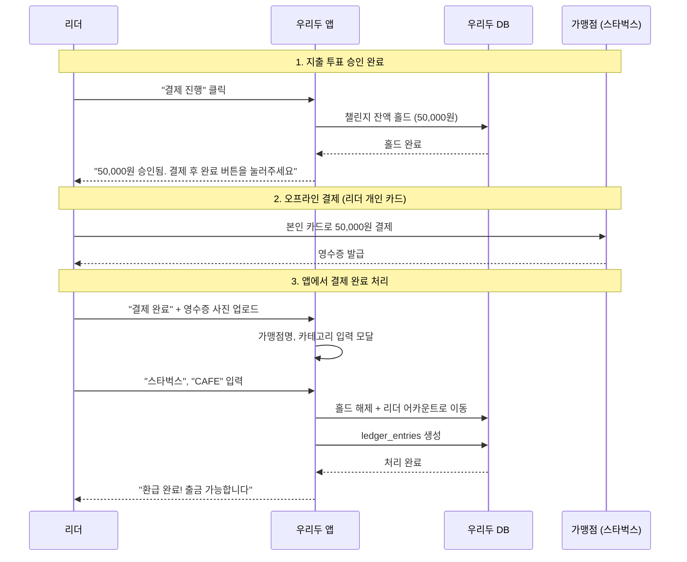
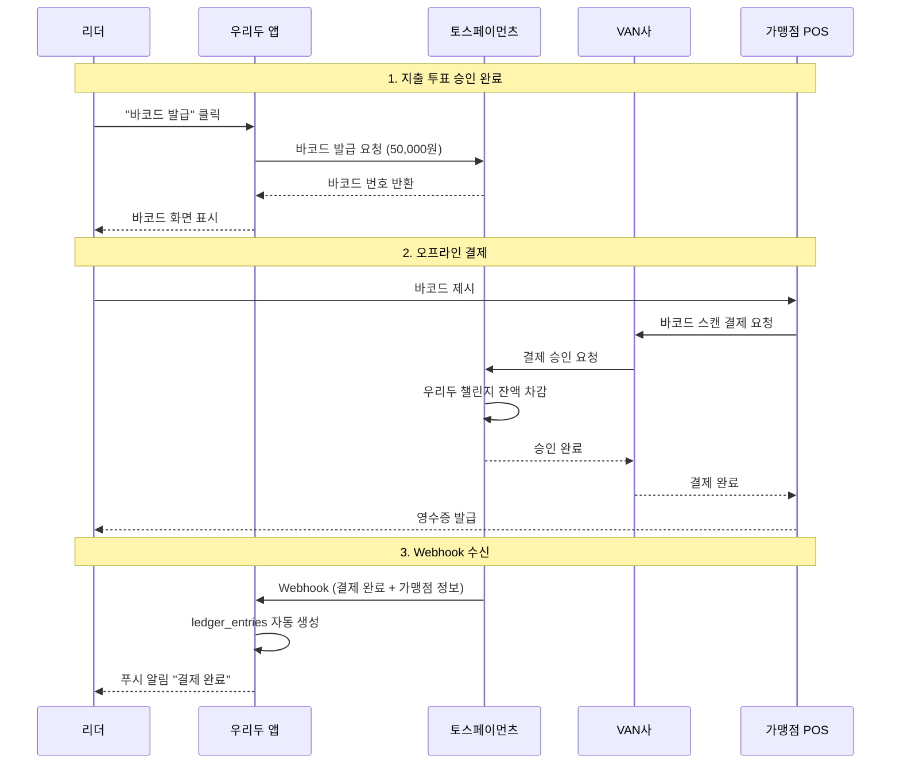

# ISSUE: 바코드 결제 흐름 및 PG 연동 명세 미비

> **이슈 ID**: ISSUE-2026-01-13-001
> **생성일**: 2026-01-13
> **상태**: 🔴 OPEN (결정 필요)
> **우선순위**: P0 - Critical
> **담당**: TBD

---

## 📋 이슈 요약

바코드 결제 시스템의 기술적 실현 가능성 검토 결과, **현재 기획된 시나리오 B(챌린지 바코드로 직접 가맹점 결제)**는 MVP 범위에서 **구현 불가능**함이 확인됨. 대안 검토 및 결정 필요.

---

## 🔍 발견 배경

### 1. 문서 검증 과정에서 발견된 누락 사항

캡처 이미지 기반 10개 항목 검증 결과:

| # | 항목 | 상태 | 비고 |
|---|------|------|------|
| 1 | 보증금 몰수 규칙 | ✅ 정의됨 | P-052 |
| 2 | 바코드 결제 흐름 | ⚠️ 유스케이스만 | UC-MEETING-10 (시퀀스 없음) |
| 3 | 바코드 유효 기간 | ✅ 정의됨 | P-053 (10분) |
| 4 | privilege_status 복구 조건 | ✅ 정의됨 | P-056 |
| 5 | 챌린지 PAUSED 전환 조건 | ✅ 정의됨 | P-057 |
| 6 | leader_last_active_at 갱신 시점 | ✅ 정의됨 | P-058 |
| 7 | NO_SHOW 점수 패널티 | ✅ 정의됨 | P-054 |
| 8 | 허위 신고 패널티 | ✅ 정의됨 | P-055 |
| 9 | 신고 20건 정지 | ✅ 정의됨 | P-030, P-057 |
| 10 | 장부 카테고리 목록 | ⚠️ 부분 정의 | enum 정의 없음 |

### 2. 바코드 결제 데이터 흐름 누락

- UC-MEETING-10에 유스케이스 시나리오만 존재
- **PG Webhook 처리**, **시퀀스 다이어그램**, **API 명세** 미정의
- 시스템 아키텍처에서 바코드 결제 흐름 설명 없음

---

## ❓ 핵심 질문 및 토론 결과

### Q1: PG 연동 포인트

**질문**: PG사 결제창 연동은 언제 발생하는가?

**답변**:
1. **개인 지갑 충전 시** → PG 결제창 연동 (토스페이) ✅ 문서화됨
2. **정기 모임 바코드 결제 시** → ❓ 흐름 미정의

---

### Q2: 바코드 결제 시나리오 명확화

**원래 기획 의도 (시나리오 B)**:
```
투표 승인 → 우리두 바코드 발급 → 실제 가맹점 POS에서 스캔 → 챌린지 잔액 직접 차감
```

**기술적 분석 결과**:

오프라인 바코드 결제가 가맹점에서 작동하려면:
```
사용자 앱(바코드) → 가맹점 POS → VAN사 → PG사 → 카드사/은행
```

**문제점**:
- 일반 가맹점 POS는 **VAN사와 연동**됨
- VAN사는 **등록된 PG사(토스페이, 카카오페이 등)**의 바코드만 인식
- 우리두는 PG사가 아니므로 **VAN에 등록 불가**
- 우리두 자체 발급 바코드는 스타벅스 등 **일반 가맹점에서 결제 불가**

---

### Q3: 실현 가능한 대안

| 방법 | 설명 | 난이도 | MVP 가능 |
|------|------|--------|----------|
| 토스페이 바코드 결제 API | 토스페이가 바코드 발급 + 결제 처리 대행 | 🔍 확인 필요 | △ |
| 우리두 PG사 등록 | 직접 PG사가 되어 VAN과 계약 | 🔴 매우 높음 | ❌ |
| 제로페이 연동 | 공공 간편결제 인프라 활용 | 🟡 중간 | △ |
| 제휴 가맹점만 지원 | 우리두와 계약한 가맹점만 | 🟡 중간 | △ |
| **시나리오 A 전환** | 리더 선결제 → 챌린지에서 환급 | 🟢 낮음 | ✅ |

---

## ✅ 합의된 사항

### 1. 챌린지 잔액 차감 시점: **Option A (선차감/홀드)**

**결정**: 바코드 발급 시 즉시 잔액 홀드, 실패/만료 시 환불

**이유**:
- 동시 바코드 발급 시 잔액 초과 방지
- 잔액 정합성 보장

**ERD 영향**:
```sql
-- payment_barcodes 테이블에 추가 필요
hold_amount NUMBER(15,2),      -- 홀드 금액
hold_status VARCHAR2(20),      -- HOLDING, RELEASED, REFUNDED
```

### 2. 장부 카테고리 분류: **Option C (MVP: 수동 입력)**

**결정**: MVP에서는 리더가 수동으로 카테고리 선택

**이유**:
- 토스페이먼츠 API에서 MCC 코드 미제공 확인됨
- 가맹점명(merchantName)도 응답에 미포함
- NLP 분류는 Post-MVP로 연기

**구현**:
```
결제 완료 후 → "어디서 사용했나요?" 모달
- 가맹점명: 텍스트 입력
- 카테고리: 드롭다운 (FOOD, CAFE, LODGING, TRANSPORT, ENTERTAINMENT, SHOPPING, OTHER)
```

---

## 🔴 미결정 사항 (결정 필요)

### 1. 바코드 결제 흐름 방향

| 옵션 | 설명 | 장점 | 단점 |
|------|------|------|------|
| **시나리오 A** | 리더 선결제 → 환급 | MVP 구현 가능, 인프라 불필요 | UX 불편 (2단계 결제) |
| **시나리오 B** | 챌린지 바코드 직접 결제 | UX 우수 | 토스페이먼츠 특별 계약 필요 |

**권장**: MVP는 시나리오 A, Post-MVP에서 토스페이먼츠 협의 후 시나리오 B 검토

### 2. 토스페이먼츠 문의 필요

**문의 사항**:
> "바코드 결제 API 사용 시, 우리두 서비스의 가상화폐(크레딧)를 결제 원천으로 사용하여 실제 오프라인 가맹점에서 결제할 수 있는 방법이 있나요? 또는 결제 완료 시 실제 결제처(가맹점)의 상호명, MCC 업종 코드가 Webhook 응답에 포함되나요?"

**연락처**:
- 이메일: support@tosspayments.com
- 전화: 1544-7772

---

## 📝 액션 아이템

| # | 액션 | 담당 | 기한 | 상태 |
|---|------|------|------|------|
| 1 | 바코드 결제 흐름 최종 결정 (A vs B) | PM | TBD | 🔴 대기 |
| 2 | 토스페이먼츠 기술 문의 발송 | Backend | TBD | 🔴 대기 |
| 3 | 시나리오 A 기준 UC-MEETING-10 수정 | 문서 | 토스 답변 후 | 🔴 대기 |
| 4 | ERD에 `hold_amount`, `hold_status` 추가 | DB | 결정 후 | 🔴 대기 |
| 5 | 장부 카테고리 enum 정의 추가 | 문서 | - | 🟡 진행 가능 |
| 6 | 시스템 아키텍처에 결제 흐름 섹션 추가 | 문서 | 결정 후 | 🔴 대기 |

---

## 📊 시나리오 A 흐름 (MVP 권장)



---

## 📊 시나리오 B 흐름 (Post-MVP 검토)



---

## 📎 관련 문서

- [UC-MEETING-10](../01_PLANNING/Requirements/UseCases/03_USE_CASE_MEETING.md#uc-meeting-10-바코드-결제-흐름-expense-투표-승인-후)
- [P-053 바코드 유효 기간 정책](../01_PLANNING/Product/POLICY_DEFINITION.md)
- [DB_Schema_1.0.0.md - payment_barcodes](../02_ENGINEERING/DB_Schema_1.0.0.md)

---

**최종 수정**: 2026-01-13
